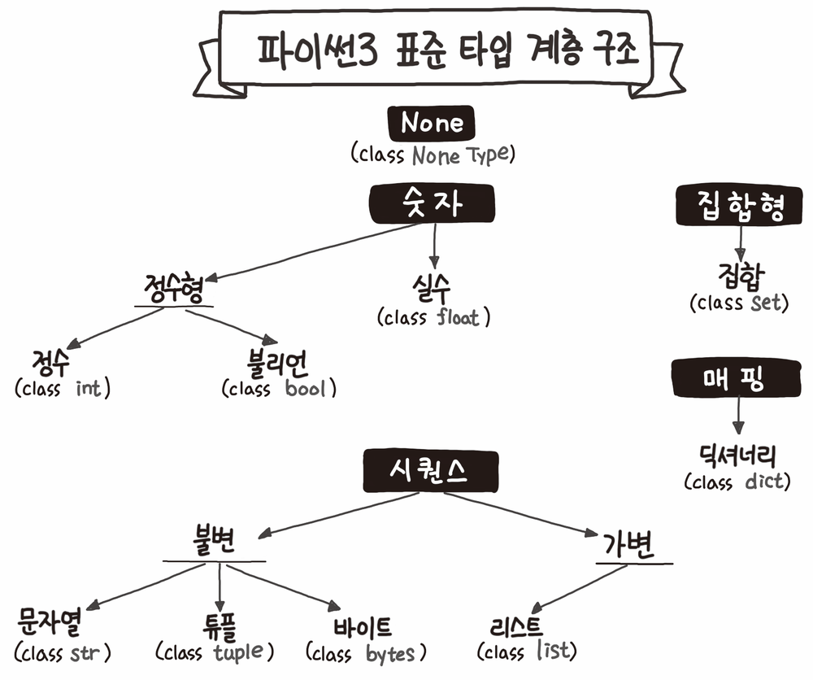
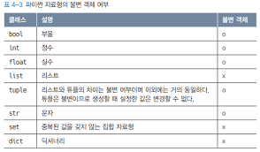
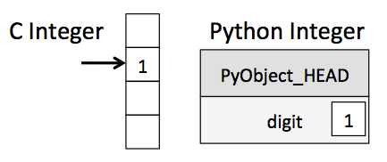

파이썬은 원시 타입의 속도를 포기하는 대신 객체의 다양한 기능과 편의성을 택했다.

파이썬은 모든 것이 객체다. 이 중에서 크게 불변 객체와 가변 객체로 구분한다. 파이썬의 각 자료형에 대한 불변 여부는 다음과 같다.

 

파이썬의 객체 구조는 잘 설계되어 있고 매우 편리하고 강력한 기능을 제공한다. 문제는 속도다. 다음 그림인 파이썬의 객체 구조가 c나 자바 같은 다른 언어에 비해 느린 이유이다.

단순히 정수형의 덧셈 연산을 하는 경우에도 메모리에서 값을 꺼내 한번 연산하면 끝인 원시 타입에 비해, 파이썬의 객체는 값을 꺼내는 데만 해도 var -> PyObject_HEAD에서 타입코드를 차즌ㄴ 등 여러 단계의 부가 작업이 필요하다.

 