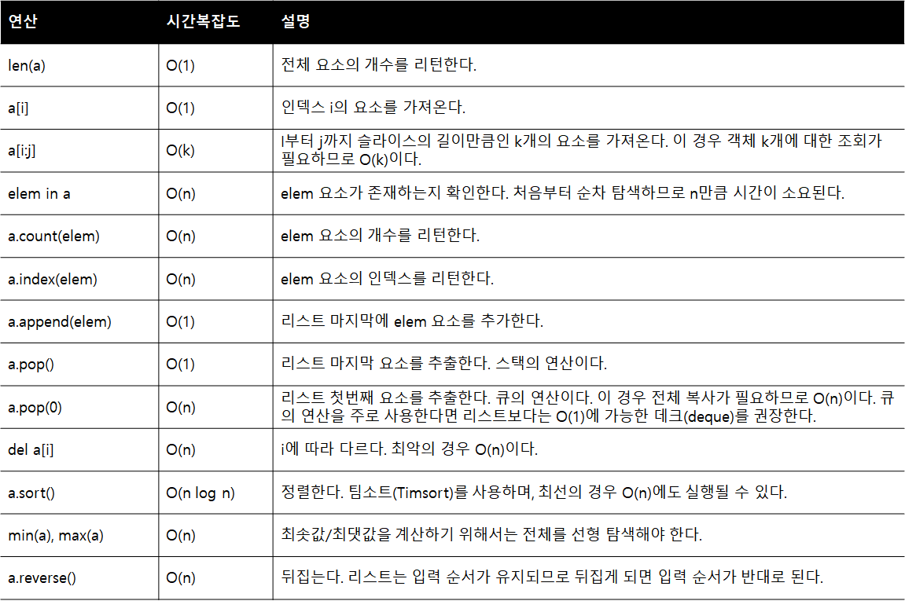
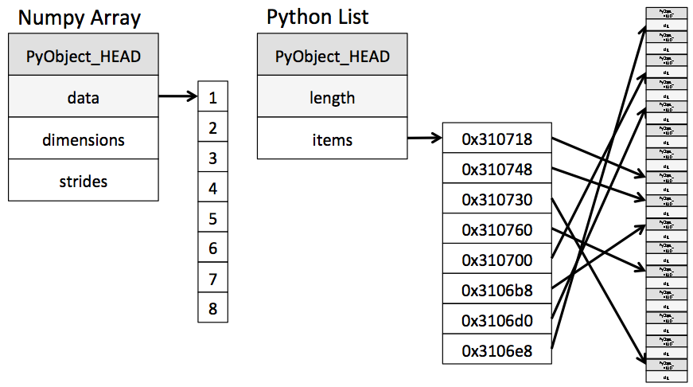
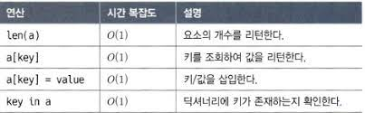

# 리스트

파이썬의 리스트는 말 그대로 순서대로 저장하는 시퀀스이자 변경 가능한 목록을 말한다. 입력 순서가 유지되며, 내부적으로는 동적 배열로 구현되어 있다.

리스트의 주요 연산과 시간 복잡도는 다음과 같다.

 

파이썬 자료형에서도 언급했었지만 파이썬의 모든 자료형은 정수형 또한 원시타입이 아닌 객체로 되어있다. 
이 때문에 리스트 또한 객체로 되어 있는 모든 자료형을 다음과 같이 포인터로 연결한다.(파이썬의 리스트에 정수, 문자, 불리언이 같이 쓰일 수 있는 이유)

 

# 딕셔너리

파이썬의 딕셔너리는 키/값 구조로 이뤄진 딕셔너리를 말한다. 입력 순서가 유지되며, 내부적으로는 해시 테이블로 구현되어 있다.

다음은 딕셔너리(해시 테이블)의 주요 연산과 시간 복잡도이다.

 

